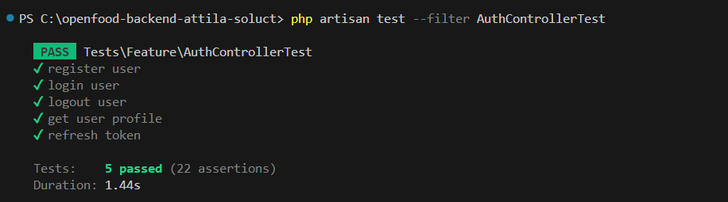

### Hi there, My name is ATTILA  SAMUELL TABORY, I love technology 👋

[](https://www.linkedin.com/in/attila-samuell-98291216b/)
[](https://www.youtube.com/channel/UCuX9fZZa3eR4LACYTPVZg5A/videos)
[](https://play.google.com/store/apps/details?id=attila.QRCodeGeradorLeitor)


# API Open Food

Esta é a API Open Food, desenvolvida por **Attila Samuell Tabory** com **PHP 8.1.2** e **Laravel 10**. Este projeto fornece endpoints para gerenciamento de produtos alimentícios, autenticação de usuários e operações de OCR (Reconhecimento Óptico de Caracteres) para ingredientes. Ele utiliza uma arquitetura limpa, separando responsabilidades em controladores, solicitações, recursos, serviços e repositórios.

## Arquitetura e Organização do Projeto

### Estrutura de Diretórios
- **app/Http/Controllers**: Contém os controladores principais, como `AuthController` e `OpenFoodController`, que lidam com autenticação e manipulação de produtos, respectivamente.
- **app/Http/Requests**: Inclui as classes de validação para as requisições de API, garantindo que os dados fornecidos pelos usuários sejam válidos antes de serem processados. Exemplo de requests: `AddOrEditProductRequest`, `LoginRequest`, `OcrRequest`.
- **app/Http/Resources**: Define os recursos para formatar as respostas de API, como `ProductResource` e `UserResource`.
- **app/Providers**: Registra serviços, como `AuthService` e `OpenFoodService`, garantindo que estejam disponíveis para injeção de dependência em toda a aplicação.
- **app/Repositories**: Implementa a lógica de acesso aos dados, como `OpenFoodRepository`, que realiza operações específicas de persistência de dados.
- **app/Services**: Camada de serviço que abstrai a lógica de negócios, incluindo `AuthService` para autenticação e `OpenFoodService` para funcionalidades relacionadas ao produto.

### Padrões de Design Utilizados
- **Repository Pattern**: Utilizado para abstrair a lógica de acesso aos dados. Por exemplo, o `OpenFoodRepository` é responsável pela comunicação com o banco de dados para operações relacionadas aos produtos, mantendo o código da aplicação desacoplado da lógica de persistência de dados.
- **Service Pattern**: Utilizado para encapsular a lógica de negócios em classes de serviço, como `AuthService` e `OpenFoodService`. Esses serviços centralizam as operações complexas, tornando o código mais organizado e testável.
- **Dependency Injection**: Utilizado para injetar dependências (por exemplo, `AuthService` e `OpenFoodService`) nas classes através do contêiner de serviços do Laravel, promovendo o baixo acoplamento e facilitando a manutenção.
- **Singleton Pattern**: Aplicado na classe `AuthService`, garantindo que exista apenas uma instância desse serviço em todo o ciclo de vida da aplicação.
- **Controller-Service-Repository Pattern**: Esse padrão ajuda a manter a separação de responsabilidades ao longo da aplicação. O controlador recebe a solicitação, o serviço processa a lógica de negócios e o repositório lida com o acesso aos dados.

### Principais Endpoints
1. **Autenticação** (`AuthController`)
   - `POST /api/login`: Realiza o login e retorna um token de acesso.
   - `POST /api/register`: Registra um novo usuário.
   - `POST /api/logout`: Faz logout do usuário autenticado.
   - `GET /api/profile`: Retorna o perfil do usuário autenticado.
   - `POST /api/refresh`: Atualiza o token de acesso.

2. **Produtos Open Food** (`OpenFoodController`)
   - `GET /api/openfood/product/{barcode}`: Busca um produto pelo código de barras.
   - `GET /api/openfood/search`: Pesquisa produtos com base em critérios específicos.
   - `GET /api/openfood/ingredient`: Realiza OCR para obter ingredientes de uma imagem.
   - `GET /api/openfood/suggestions`: Retorna sugestões de produtos.
   - `GET /api/openfood/nutrients`: Obtém informações nutricionais de produtos.
   - `GET /api/openfood/attribute-groups`: Lista grupos de atributos de produtos.
   - `GET /api/openfood/preferences`: Obtém preferências de usuário relacionadas a produtos.
   - `POST /api/openfood/product`: Adiciona ou edita um produto.
   - `POST /api/openfood/product/photo`: Adiciona uma foto ao produto.
   - `POST /api/openfood/rotate-photo`: Gira a foto do produto.
   - `POST /api/openfood/crop-photo`: Recorta a foto do produto.

### Configuração Inicial
Para instalar o projeto, siga os passos abaixo:

1. **Clonar o repositório** e criar o arquivo `.env`:
   ```bash
   cp .env.example .env
   ```

2. **Instalar as dependências**:
   ```bash
   composer install
   ```

3. **Gerar a chave de aplicação**:
   ```bash
   php artisan key:generate
   ```

4. **Executar as migrações**:
   ```bash
   php artisan migrate
   ```
### Documentação da API
Para documentação da API, o projeto utiliza **Scribe**, uma ferramenta que gera automaticamente documentação detalhada dos endpoints. A documentação é gerada a partir dos comentários e tipos de retorno definidos nos controladores e está disponível para consulta no ambiente local. Isso permite que desenvolvedores tenham uma visão clara dos endpoints disponíveis e suas respectivas requisições e respostas.

Para gerar ou atualizar a documentação com Scribe, utilize o comando:
```bash
php artisan scribe:generate
```

### Testes de Autenticação
O projeto inclui testes de autenticação (localizados em `tests/Feature/AuthControllerTest.php`) para garantir a integridade das operações de registro, login, logout, atualização de token e perfil do usuário.



### Tecnologias e Ferramentas Utilizadas
- **Back-end**: PHP 8.1.2, Laravel 10
- **Autenticação**: Laravel Sanctum para autenticação baseada em tokens
- **OCR**: Implementado para reconhecimento de texto de ingredientes em imagens

### Requisitos
- **Composer e PHP**
- **Servidor de desenvolvimento**: Xampp ou Wampp

---


